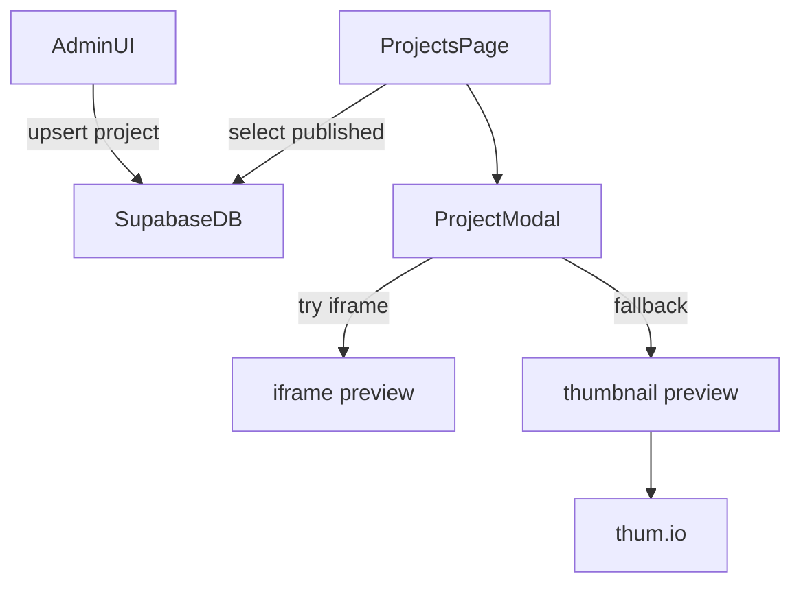

# Architectuur

## Stack
- Next.js (App Router) + Tailwind + shadcn/ui patterns
- Supabase (Auth + Postgres + RLS)
- Hosting: Vercel

## Routing (high level)
- Public:
  - `/` home
  - `/projects` projectenoverzicht + modal previews
  - `/blog` logboek
  - `/timeline` voortgang
  - `/about`, `/contact`
- Privé:
  - `/login`
  - `/admin/*` (alleen jouw account)

## Auth & toegang
- Route bescherming via [`middleware.ts`](../middleware.ts) voor `/admin/*`
- Database security via RLS policies (zie [`supabase/schema.sql`](../supabase/schema.sql))

## Data flow (project preview)

